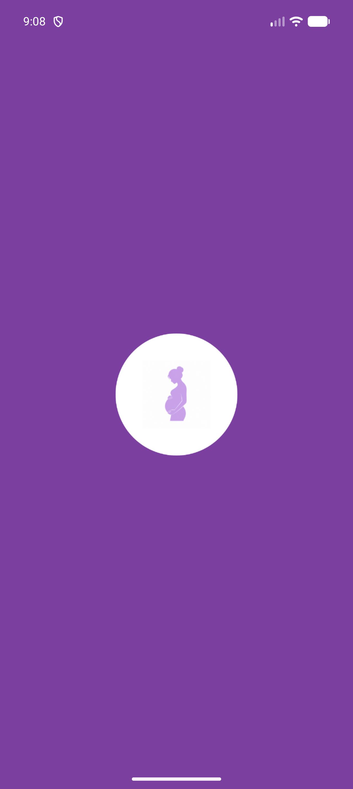
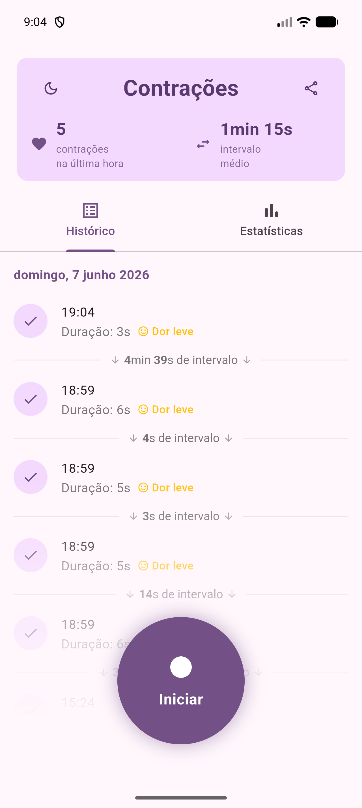
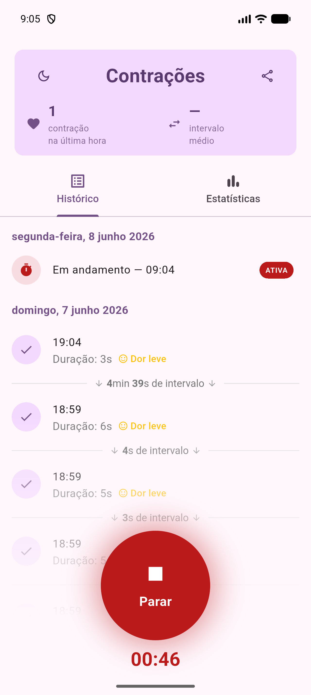
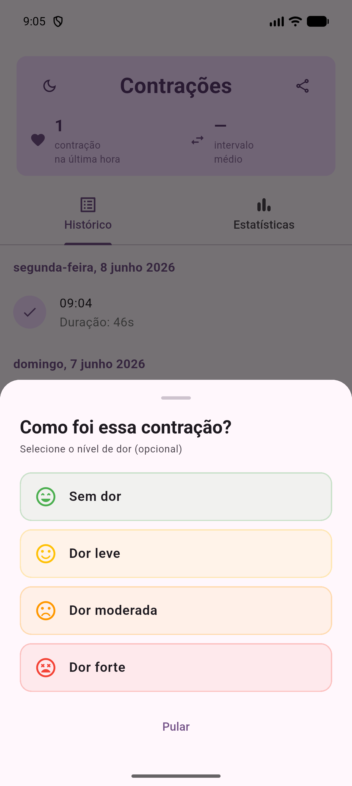
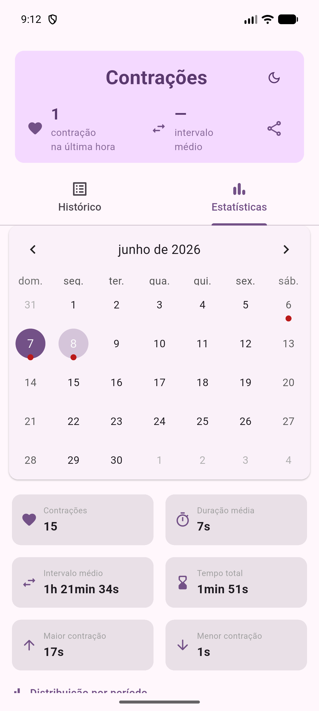
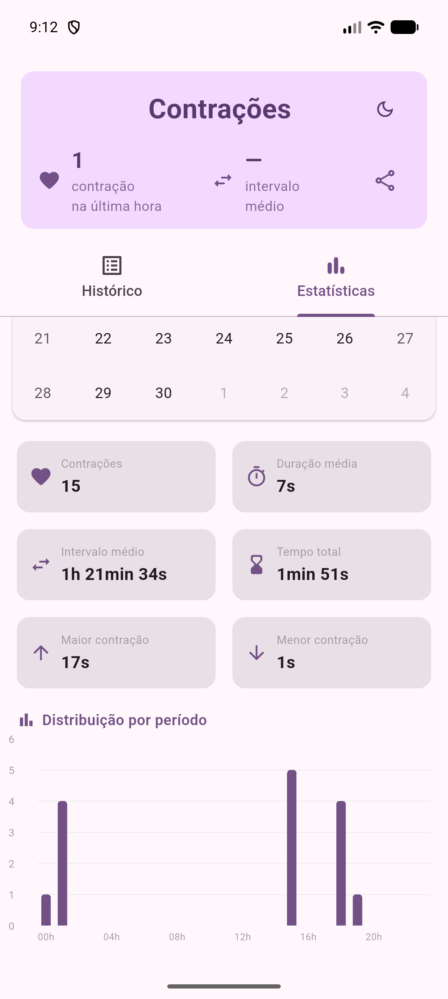
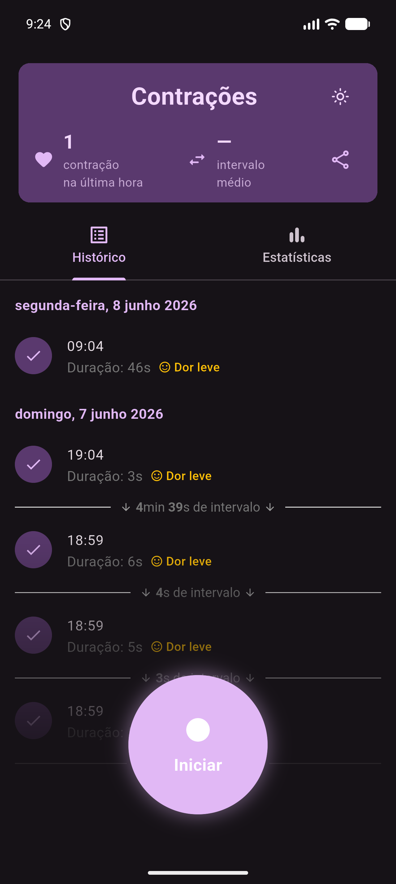
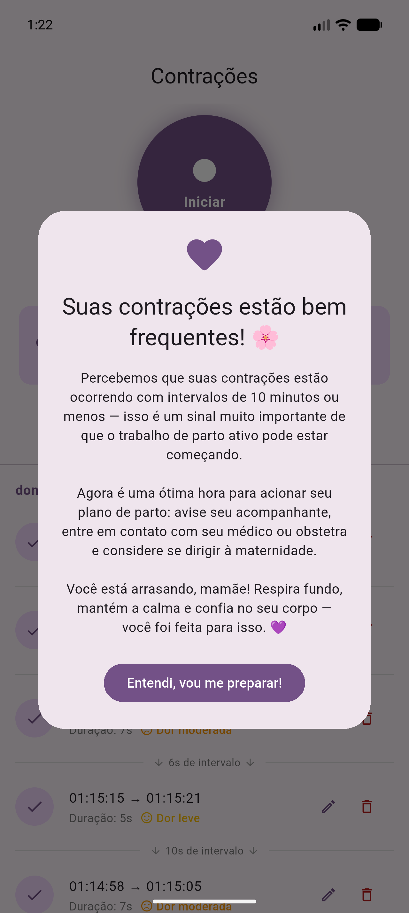

# Contrações

Aplicativo para registro e acompanhamento de contrações uterinas durante o trabalho de parto. Disponível para **Android e iOS**, desenvolvido em Flutter e funciona 100% offline com armazenamento local.

---

## Fluxo do aplicativo

### Abertura → Histórico → Contração ativa

<table align="center">
  <tr>
    <td align="center"><b>Inicialização</b></td>
    <td align="center"></td>
    <td align="center"><b>Histórico</b></td>
    <td align="center"></td>
    <td align="center"><b>Contração ativa</b></td>
  </tr>
  <tr>
    <td align="center"></td>
    <td align="center" valign="middle"><b>&nbsp;→&nbsp;</b></td>
    <td align="center"></td>
    <td align="center" valign="middle"><b>&nbsp;→&nbsp;</b></td>
    <td align="center"></td>
  </tr>
  <tr>
    <td align="center"><sub>Tela de carregamento</sub></td>
    <td></td>
    <td align="center"><sub>Resumo da última hora,<br/>histórico e botão de registro</sub></td>
    <td></td>
    <td align="center"><sub>Timer ao vivo, badge ATIVA<br/>e botão Parar</sub></td>
  </tr>
</table>

### Registrar dor → Estatísticas → Gráfico

<table align="center">
  <tr>
    <td align="center"><b>Seleção de nível de dor</b></td>
    <td align="center"></td>
    <td align="center"><b>Estatísticas por dia</b></td>
    <td align="center"></td>
    <td align="center"><b>Distribuição por período</b></td>
  </tr>
  <tr>
    <td align="center"></td>
    <td align="center" valign="middle"><b>&nbsp;→&nbsp;</b></td>
    <td align="center"></td>
    <td align="center" valign="middle"><b>&nbsp;→&nbsp;</b></td>
    <td align="center"></td>
  </tr>
  <tr>
    <td align="center"><sub>Sheet com opções de<br/>intensidade (opcional)</sub></td>
    <td></td>
    <td align="center"><sub>Calendário mensal + métricas<br/>do dia selecionado</sub></td>
    <td></td>
    <td align="center"><sub>Barras por faixa horária</sub></td>
  </tr>
</table>

### Tema escuro · Alerta de trabalho de parto

<table align="center">
  <tr>
    <td align="center"><b>Modo escuro</b></td>
    <td align="center"></td>
    <td align="center"><b>Alerta de maternidade</b></td>
  </tr>
  <tr>
    <td align="center"></td>
    <td align="center" valign="middle"><b>&nbsp;&nbsp;&nbsp;&nbsp;</b></td>
    <td align="center"></td>
  </tr>
  <tr>
    <td align="center"><sub>Toggle no card de resumo,<br/>preferência salva entre sessões</sub></td>
    <td></td>
    <td align="center"><sub>Disparado automaticamente com<br/>5+ contrações em ≤ 10 min</sub></td>
  </tr>
</table>

---

## Funcionalidades

**Registro**
- Botão central para iniciar e encerrar cada contração com um único toque
- Cronômetro em tempo real exibido durante a contração ativa, com badge **ATIVA** no histórico
- Seleção opcional do nível de dor ao encerrar cada contração (Sem dor / Leve / Moderada / Forte)

**Barra de resumo (última hora)**
- Contador de contrações e intervalo médio atualizados em tempo real
- Toggle de tema claro/escuro integrado ao card, com preferência persistida localmente
- Botão de compartilhamento: abre a folha nativa de compartilhamento do sistema com um resumo formatado pronto para enviar ao obstetra

**Histórico**
- Lista agrupada por dia, com horário de início, duração, nível de dor e intervalo entre contrações
- Intervalos longos exibidos em horas: `2h 5min 34s`
- **Swipe para a direita** em qualquer item abre o modal de edição (duração + nível de dor)
- **Swipe para a esquerda** solicita confirmação de exclusão
- Botão flutuante de scroll ao topo, visível apenas quando fora do início da lista

**Estatísticas**
- Calendário mensal com marcadores nos dias com registros
- Métricas do dia selecionado: total, duração média, intervalo médio, tempo total, maior e menor contração
- Gráfico de barras com distribuição das contrações por faixa horária

**Alertas**
- Alerta automático quando 5 ou mais contrações ocorrem com intervalos ≤ 10 min na última hora

**Tema**
- Tema claro e escuro com a mesma identidade visual roxa
- Preferência persistida via SharedPreferences — mantida ao fechar e reabrir o app

---

## Exemplo do resumo compartilhado

Ao tocar no ícone de compartilhamento no card de resumo, a folha nativa do sistema é aberta com o seguinte texto:

```
Contrações — resumo da última hora
Gerado em 08/06/2026 09:04

Total: 5 contrações
Intervalo médio: 8min 30s
Duração média: 47s

Detalhes:
1. 08/06/2026 08:10 — 52s — Dor leve
2. 08/06/2026 08:19 — 45s — Sem dor
3. 08/06/2026 08:28 — 48s — Dor moderada
4. 08/06/2026 08:37 — 44s
5. 08/06/2026 08:46 — em andamento
```

O nível de dor aparece quando registrado. Contrações sem nível exibem apenas horário e duração.

---

## Stack

| Camada | Tecnologia |
|---|---|
| Framework | Flutter 3.44.1 / Dart 3.12.1 |
| Banco de dados | sqflite (SQLite local) |
| Estado | provider |
| Persistência de preferências | shared_preferences |
| Calendário | table_calendar |
| Gráficos | fl_chart |
| Compartilhamento | share_plus |
| Internacionalização | intl (pt_BR) |

---

## Estrutura do projeto

```
lib/
├── main.dart                         # Pré-carrega SharedPreferences antes do runApp
├── models/
│   ├── contraction.dart              # Modelo com startTime, endTime, duration, painLevel
│   └── day_stats.dart                # Agregações por dia (média, total, etc.)
├── database/
│   └── database_helper.dart          # Singleton SQLite com migrations
├── providers/
│   ├── contraction_provider.dart     # ChangeNotifier + timer ticker
│   └── theme_provider.dart           # ThemeMode com persistência
├── screens/
│   ├── splash_screen.dart            # Tela de carregamento animada
│   └── home_screen.dart              # TabController + overlay de gradiente + FAB
└── widgets/
    ├── contraction_button.dart        # Botão circular animado (iniciar/parar)
    ├── contraction_list.dart          # Histórico com Dismissible (editar/excluir)
    ├── summary_bar.dart               # Resumo da última hora + tema + compartilhamento
    └── stats_section.dart             # Calendário + métricas + gráfico
```

---

## Como compilar

### Android

```bash
flutter pub get
flutter run                        # debug
flutter build apk --release        # APK de release
```

### iOS

Pré-requisitos: Flutter SDK, Xcode e um Mac. A pasta `ios/` está versionada com todas as configurações necessárias.

```bash
flutter pub get
cd ios && pod install && cd ..
flutter run -d <device-id>         # debug no iPhone/simulador
flutter build ios --release        # build de release
```

> **Nota:** A pasta `android/` não está versionada — é gerada automaticamente pelo Flutter. Para regenerá-la:
> ```bash
> flutter create --platforms android .
> ```
