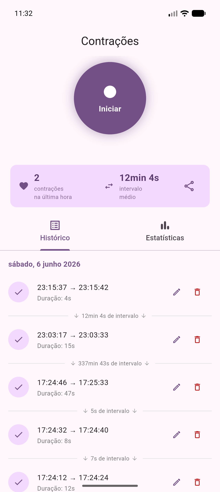
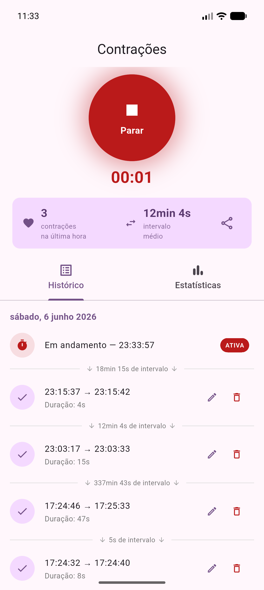
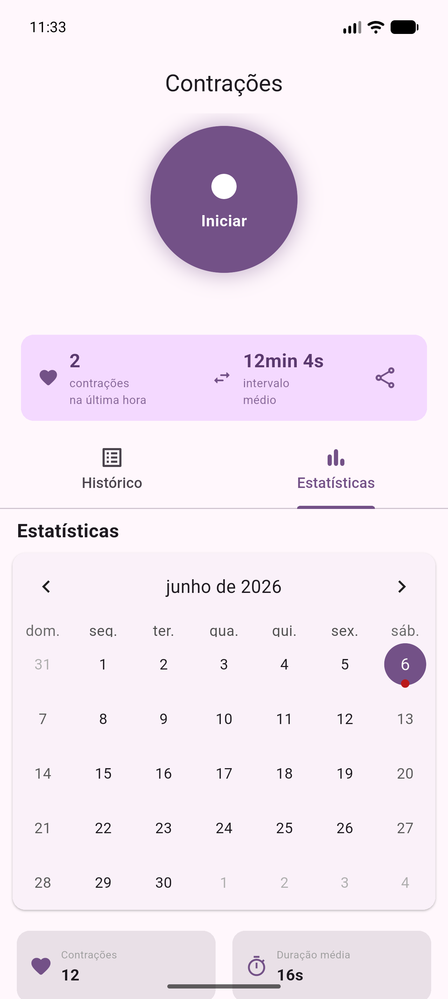

# Contrações

Aplicativo Android para registro e acompanhamento de contrações uterinas durante o trabalho de parto. Desenvolvido em Flutter, funciona 100% offline com armazenamento local.

## Screenshots

<p align="center">
  
  &nbsp;&nbsp;&nbsp;
  
  &nbsp;&nbsp;&nbsp;
  
</p>
<p align="center">
  <em>Tela principal · Contração em andamento · Estatísticas por dia</em>
</p>

## Funcionalidades

**Registro**
- Botão central para iniciar e encerrar cada contração com um único toque
- Cronômetro em tempo real exibido durante a contração ativa
- Badge "ATIVA" destacado no histórico para a contração em andamento

**Barra de resumo (última hora)**
- Contador de contrações na última hora
- Intervalo médio entre contrações
- Botão de compartilhamento: gera e copia para a área de transferência um resumo formatado pronto para enviar ao obstetra via WhatsApp

**Histórico**
- Lista agrupada por dia, com horário de início, fim e duração de cada contração
- Intervalo entre contrações exibido entre cada item
- Edição de duração (caso o registro precise de ajuste)
- Exclusão com confirmação via botão

**Estatísticas**
- Calendário mensal com marcadores nos dias com registros
- Métricas do dia selecionado: total de contrações, duração média, intervalo médio, tempo total, maior e menor contração
- Gráfico de barras com distribuição das contrações por hora do dia

**Alertas**
- Alerta automático quando as contrações estão ocorrendo com intervalos de 10 minutos ou menos por pelo menos 1 hora — sinal de trabalho de parto ativo

## Exemplo do resumo para o obstetra

Ao tocar no ícone de compartilhamento na barra de resumo, o seguinte texto é copiado:

```
Contrações — resumo da última hora
Gerado em 06/06/2026 14:32

Total: 5 contrações
Intervalo médio: 8min 30s
Duração média: 47s

Detalhes:
1. 06/06/2026 13:45 — 52s
2. 06/06/2026 13:54 — 45s
3. 06/06/2026 14:03 — 48s
4. 06/06/2026 14:12 — 44s
5. 06/06/2026 14:21 — em andamento
```

## Stack

| Camada | Tecnologia |
|---|---|
| Framework | Flutter 3.44.1 / Dart 3.12.1 |
| Banco de dados | sqflite (SQLite local) |
| Estado | provider |
| Calendário | table_calendar |
| Gráficos | fl_chart |
| Internacionalização | intl (pt_BR) |

## Estrutura do projeto

```
lib/
├── main.dart
├── models/
│   ├── contraction.dart      # Modelo com startTime, endTime, duration
│   └── day_stats.dart        # Agregações por dia (média, total, etc.)
├── database/
│   └── database_helper.dart  # Singleton SQLite
├── providers/
│   └── contraction_provider.dart  # ChangeNotifier + timer ticker
├── screens/
│   └── home_screen.dart      # Tela principal com alerta de trabalho de parto
└── widgets/
    ├── contraction_button.dart  # Botão circular animado
    ├── contraction_list.dart    # Histórico agrupado por dia
    ├── summary_bar.dart         # Resumo da última hora + compartilhamento
    └── stats_section.dart       # Calendário + gráfico + métricas
```

## Como compilar

Pré-requisitos: Flutter SDK instalado e um dispositivo Android conectado ou emulador ativo.

```bash
# Instalar dependências
flutter pub get

# Rodar em modo debug
flutter run

# Gerar APK de release
flutter build apk --release
```

> As pastas `android/` e `ios/` não estão no repositório — são geradas automaticamente pelo Flutter. Para regenerá-las:
> ```bash
> flutter create --platforms android,ios .
> ```
